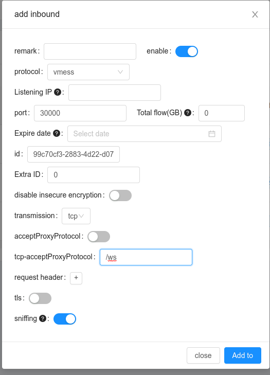

## [V2Ray](https://www.v2ray.com/) Setup


In this repo we will setup v2ray with [x-ui](https://github.com/vaxilu/x-ui) dashboards


client  **⇨**  (shadowsocks, vmess) **⇨** bridge(xui) **⇨** tls-vmess **⇨** upstream(nginx(SSL) -> xui)

what we need for setup?

1 - domain (preferred to handle with cloudflare)
2 - two vps (bridge, upstream)

------------------------------------------------

on **bridge** just need need to setup this!

simple `docker-compose.yml` for setup xui 
```
version: "3"
services:
  xui:
    image: enwaiax/x-ui
    container_name: xui
    volumes:
      - $PWD/db/:/etc/x-ui/
      - $PWD/cert/:/root/cert/
    network_mode: host
```

`docker-compose -f docker-compose-xui.yml up -d`

_panel will set up on port 54321 , user:admin, pass:admin_

----------------------------------------------------

on upstream you need to have nginx & certbot also installed

```
sudo apt-get update
sudo apt-get install nginx certbot python3-certbot-nginx
```

then add an A record on dns with upstream IP and domain name.

after that you need to sign with 
```
certbot --nginx -d {{domain}}
```
----------------------------------------------------

How should I config them?

##### UPSTREAM :
you need to create a vmess account on upstream through panel with localhost, websocket and path /ws (check img)

<div align="center">

</div>

then config nginx as reverse proxy (check nginx.conf and use it on `/etc/nginx/sites-enabled/default`)

##### BRIDGE :
you need to complete config.yml with UID, HOST, PORT and put the config on x-ui panel of bridge.

then create account on bridge and enjoy!!!

----------------------------------------------------
### Installation

make run

for more details run make help

----------------------------------------------------
### Extra
-> Use cloudflare CDN
1 - Go to SSL/TLS configuration => Overview on panel and choose full(strict) mode
2 - Go to SSL/TLS configuration => Origin Server on panel and create ssl cert.pem and key.pem
3 - copy cert.pem and key.pem (step 2) onto server and change nginx config like following configs
```
    ssl_certificate /etc/letsencrypt/live/{{domain}}/fullchain.pem; # managed by Certbot
    ssl_certificate_key /etc/letsencrypt/live/{{domain}}/privkey.pem; # managed by Certbot
``` 
TO
```
    ssl_certificate /{{cert path}}/cert.pem; 
    ssl_certificate_key /{{key path}}/key.pem;
```
4 - reload nginx config with following command:
```
sudo nginx -t
```
if all things was ok then run
```
sudo nginx -s reload
```

----------------------------------------------------
TODO:

1 - automate cloudflare cdn config.

2 - create some dockerfile to deploy easily on cloud envs.

-----------------------------------------------------
Related Links:
 - https://seakfind.github.io/2021/10/10/X-UI/#Add-VLESS-XTLS-Xray-User