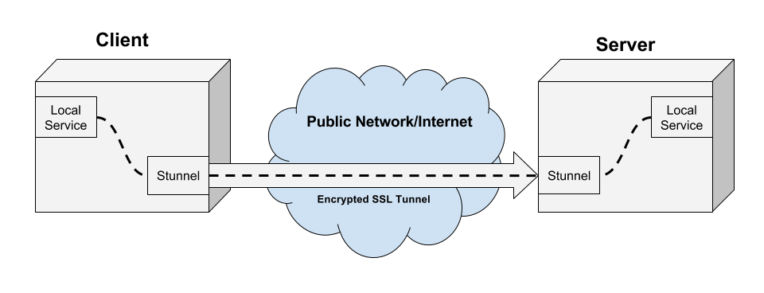
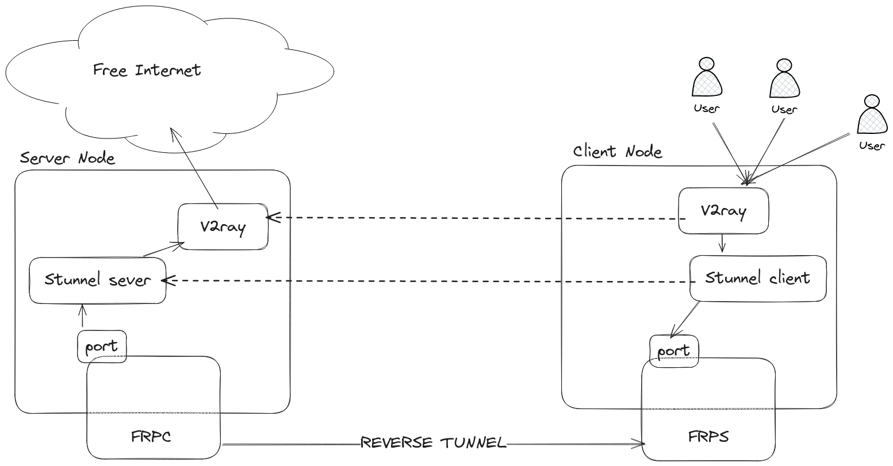

## [V2Ray](https://www.v2ray.com/) Setup + STUNNEL + FRP [EASY SETUP](#easy-setup)
(Before start check __other branches__ for other setups)


https://charlesreid1.github.io/stunnel.html


### What Does Stunnel Do?

Stunnel is a tool for creating SSL tunnels between a client and a server.

STUNNEL GITHUB: https://github.com/mtrojnar/stunnel

### What is frp?

frp is a fast reverse proxy that allows you to expose a local server located behind a NAT or firewall to the Internet. It currently supports TCP and UDP, as well as HTTP and HTTPS protocols, enabling requests to be forwarded to internal services via domain name.

FRP GITHUB: https://github.com/fatedier/frp

### Architecture Overview

### Setup
As you see in above photo we will setup stunnel as our secure tunnel and pass v2ray traffic over it.
(__Local Services__ in above photo in this case is __v2ray node__)

### Steps

1 - Run `install.sh` to install requirements in each VPS.(we can not run them on pods as we are using `systemctl`)

2 - Setup stunnel `server-node`:
```Bash
cd v2ray-setup
vim server.conf # Modify V2RAY-PORT to a real free port like 9999
cp server.conf /etc/stunnel/
cd /etc/stunnel/
openssl genrsa -out stunnel.key 2048
# Please avoid to use some random stuff like test.
openssl req -new -key stunnel.key -out stunnel.csr
openssl x509 -req -days 365 -in stunnel.csr -signkey stunnel.key -out stunnel.crt
cat stunnel.crt stunnel.key > stunnel.pem # You need to use it in client as well
sudo systemctl restart stunnel4.service
systemctl status stunnel4.service # You should see everything is fine
```

3 - Setup frpc on `server-node`:

```Bash
wget https://github.com/fatedier/frp/releases/download/v0.58.1/frp_0.58.1_linux_amd64.tar.gz
tar -xvf frp_0.58.1_linux_amd64.tar.gz
cd frp_0.58.1_linux_amd64
```

Adjust `frpc.toml` as following:

```Bash
serverAddr = "{client-node IP/domain}"
serverPort = 7000 # Default

[[proxies]]
name = "test-tcp"
type = "tcp"
localIP = "127.0.0.1"
localPort = 443 # This is stunnel server listening port
remotePort = 4444 # Expected port in client node.
```

Then run :
```Bash
./frpc -c frpc.toml
```

Or define a systemd service and enable/start it.

4 - Setup stunnel `client-node`:
```Bash
cd v2ray-setup
vim client.conf # Use your server ip in the config
cp client.conf /etc/stunnel/
scp {STUNNEL_SERVER}:/etc/stunnel/stunnel.pem /etc/stunnel/stunnel.pem
sudo systemctl restart stunnel4.service
systemctl status stunnel4.service # You should see everything is fine
```

5 - Setup frps on `client-node`:

```Bash
wget https://github.com/fatedier/frp/releases/download/v0.58.1/frp_0.58.1_linux_amd64.tar.gz
tar -xvf frp_0.58.1_linux_amd64.tar.gz
cd frp_0.58.1_linux_amd64
```

Then run :
```Bash
./frps -c frps.toml
```

Or again define a systemd service and enable/start it.


Note: Defining a systemd service help you to install the service in your machine more stable

6 - Setup x-ui in server (on stunnel VPS) and create an account there with a port listening to `V2RAY-PORT` like 9999

Sample config(default)
```json
{
  "api": {
    "services": [
      "HandlerService",
      "LoggerService",
      "StatsService"
    ],
    "tag": "api"
  },
  "inbounds": [
    {
      "listen": "127.0.0.1",
      "port": 62789,
      "protocol": "dokodemo-door",
      "settings": {
        "address": "127.0.0.1"
      },
      "tag": "api"
    }
  ],
  "outbounds": [
    {
      "protocol": "freedom",
      "settings": {}
    },
    {
      "protocol": "blackhole",
      "settings": {},
      "tag": "blocked"
    }
  ],
  "policy": {
    "system": {
      "statsInboundDownlink": true,
      "statsInboundUplink": true
    }
  },
  "routing": {
    "rules": [
      {
        "inboundTag": [
          "api"
        ],
        "outboundTag": "api",
        "type": "field"
      },
      {
        "ip": [
          "geoip:private"
        ],
        "outboundTag": "blocked",
        "type": "field"
      },
      {
        "outboundTag": "blocked",
        "protocol": [
          "bittorrent"
        ],
        "type": "field"
      }
    ]
  },
  "stats": {}
}
```
4 - setup x-ui in client

Notice that in client config you should use `localhost:4443` rather than server ip, port like following:
```json
{
  "api": {
    "services": [
      "HandlerService",
      "LoggerService",
      "StatsService"
    ],
    "tag": "api"
  },
  "inbounds": [
    {
      "listen": "127.0.0.1",
      "port": 62789,
      "protocol": "dokodemo-door",
      "settings": {
        "address": "127.0.0.1"
      },
      "tag": "api"
    }
  ],
  "outbounds": [
      {
        "tag": "proxy",
        "protocol": "vmess",
        "settings": {
          "vnext": [
             {
            "address": "localhost",
            "port": 4443,
            "users": [
              {
                "alterId": 0,
                "encryption": "",
                "flow": "",
                "id": "{VMESS-ID}",
                "level": 8,
                "security": "auto"
              }
            ]
          }
        ]
      },
      "streamSettings": {
        "network": "tcp",
        "security": "none",
        "tcpSettings": {
          "header": {
            "type": "none"
          }
        }
      },
      "tag": "proxy"
    },

    {
      "protocol": "blackhole",
      "settings": { },
      "tag": "blocked"
    },
    {
      "tag": "InternalDNS",
      "protocol": "dns"
    }
  ],
  "policy": {
    "system": {
      "statsInboundDownlink": true,
      "statsInboundUplink": true
    }
  },
  "routing": {
    "rules": [
      {
        "type": "field",
        "outboundTag": "freedom",
        "domain": [
          "regexp:.*\\.ir$",
          "domain:digikala.com",
          "snapp.express",
          "aparat.com",
          "full:google.com",
          "overleaf.com",
        ]
      },
      {
        "inboundTag": [
          "api"
        ],
        "outboundTag": "api",
        "type": "field"
      },
      {
        "outboundTag": "blocked",
        "protocol": [
          "bittorrent"
        ],
        "type": "field"
      }
    ]
  },
  "stats": { }
}
```

Feel free to manage your accounts just over the client server!


## Debug

1 - use `journalctl -fu stunnel4.service` to check related logs(Or other logs like frpc/frps)

2 - to check your stunnel server you can use following command:

```bash
openssl s_client -connect {STUNNEL_SERVER/CLIENT}:4443 -debug -msg -servername cloudflare.com -tls1_2 
```

3 - Check firewall

4 - `iftop, tcpdump, telnet, ss, nc` are general helpful network tools


## Easy setup with [FAB](https://www.fabfile.org/)
<a name="easy-setup"></a>

Setup env
```bash
python3.8 -m venv venv
source venv/bin/activate
fab -l # To see list of jobs
```

1 - Setup nodes with requirements:

```bash
export I_USER={}
export E_USER={}
export I_H={} # Domain or IP
export E_H={} # Domain or IP
fab setup-nodes -H $I_USER@I_H,$E_USER@$E_H
```

2 - Setup external node (frp, stunnel):
```bash
fab setup-external-node --internal-node-ip $I_H -H $E_USER@$E_H
```

3 - Setup internal node (frp, stunnel):
```bash
fab setup-internal-node --external-address $E_USER@$E_H -H $I_USER@$I_H
```

4 - Go to external x-ui port 54321 and login with `admin, admin` and create a vmess account
with tcp config and pick `UID` to use it for next step

5 - Go to internal ip/domain 54321 port, login with admin,admin and update config to:
```json
{
    "api": {
      "services": [
        "HandlerService",
        "LoggerService",
        "StatsService"
      ],
      "tag": "api"
    },
    "inbounds": [
      {
        "listen": "127.0.0.1",
        "port": 62789,
        "protocol": "dokodemo-door",
        "settings": {
          "address": "127.0.0.1"
        },
        "tag": "api"
      }
    ],
    "outbounds": [
        {
          "tag": "proxy",
          "protocol": "vmess",
          "settings": {
            "vnext": [
               {
              "address": "localhost",
              "port": 4443,
              "users": [
                {
                  "alterId": 0,
                  "encryption": "",
                  "flow": "",
                  "id": {{UID FROM EXTERNAL HOST}},
                  "level": 8,
                  "security": "auto"
                }
              ]
            }
          ]
        },
        "streamSettings": {
          "network": "tcp",
          "security": "none",
          "tcpSettings": {
            "header": {
              "type": "none"
            }
          }
        },
        "tag": "proxy"
      },
  
      {
        "protocol": "blackhole",
        "settings": { },
        "tag": "blocked"
      },
      {
        "tag": "InternalDNS",
        "protocol": "dns"
      }
    ],
    "policy": {
      "system": {
        "statsInboundDownlink": true,
        "statsInboundUplink": true
      }
    },
    "routing": {
      "rules": [
        {
          "type": "field",
          "outboundTag": "freedom",
          "domain": [
            "regexp:.*\\.ir$",
            "domain:digikala.com",
            "snapp.express",
            "aparat.com",
            "full:google.com",
            "overleaf.com"
          ]
        },
        {
          "inboundTag": [
            "api"
          ],
          "outboundTag": "api",
          "type": "field"
        },
        {
          "outboundTag": "blocked",
          "protocol": [
            "bittorrent"
          ],
          "type": "field"
        }
      ]
    },
    "stats": { }
  }
```

Enjoy!